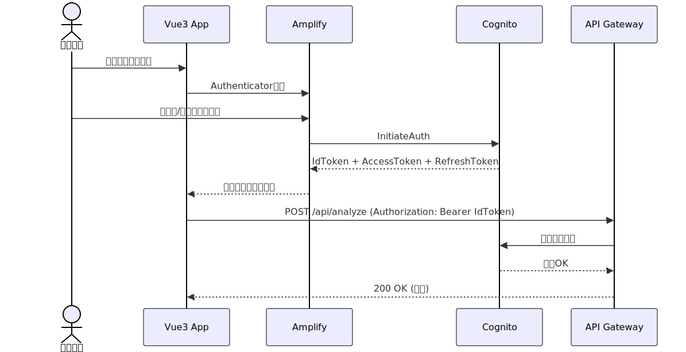

# API詳細設計書

## エンドポイント一覧

| メソッド | パス | 認証 | 説明 |
|---------|------|------|------|
| POST | /api/analyze | Cognito JWT | 画像解析（テスト画面用） |
| POST | /api/workflow/analyze | APIキー | 画像解析（ワークフロー用） |
| GET | /api/health | なし | ヘルスチェック |

※ CloudFront経由時 `/api/*` → API Gateway `/prod/*` にリライトされる

## 認証方式



| 方式 | ヘッダー | 対象エンドポイント | 用途 |
|------|---------|-------------------|------|
| Cognito JWT | `Authorization: Bearer <token>` | /api/analyze | テスト画面 |
| APIキー | `x-api-key: <key>` | /api/workflow/analyze | ワークフロー連携 |
| なし | - | /api/health | ヘルスチェック |

## POST /api/analyze

### リクエスト

```json
{
  "image": "data:image/jpeg;base64,/9j/4AAQ...",
  "target": "crack",
  "model": "gpt-4.1-mini",
  "detail": "low"
}
```

| フィールド | 型 | 必須 | デフォルト | 説明 |
|-----------|------|------|----------|------|
| image | string | ※ | - | base64画像 (data URI or raw) |
| data | string | ※ | - | raw base64 (ワークフロー用、imageと排他) |
| image_bucket | string | - | - | S3バケット名（image_keyと組み合わせ） |
| image_key | string | - | - | S3オブジェクトキー（image_bucketと組み合わせ） |
| image_url | string | - | - | 画像URL（*.amazonaws.comのみ） |
| filename | string | - | - | ファイル名 |
| target | string | Yes | - | 検出対象オブジェクト |
| model | string | - | gpt-4.1-mini | gpt-4.1-mini / gpt-4.1 / gpt-5.2 |
| detail | string | - | low | low / high / auto |

※ `image_bucket`+`image_key` / `image_url` / `image` / `data` のいずれか必須（優先順位順）

### レスポンス (200 OK)

```json
{
  "found": true,
  "context": "この画像に「crack」は存在しますか？",
  "answer": "はい、画像の右側に左下にひび割れが確認できます。",
  "confidence": 92,
  "model": "gpt-4.1-mini",
  "usage": {
    "prompt_tokens": 1200,
    "completion_tokens": 85,
    "total_tokens": 1285
  },
  "elapsed_seconds": 2.34
}
```

| フィールド | 型 | 説明 |
|-----------|------|------|
| found | boolean | 検出有無 |
| context | string | AIに送信したプロンプト |
| answer | string | AIの返答 |
| confidence | number | 確信度 (0-100) |
| model | string | 使用モデル名 |
| usage | object | トークン使用量 |
| elapsed_seconds | number | 処理時間（秒） |

## GET /api/health

### レスポンス (200 OK)

```json
{
  "status": "ok",
  "timestamp": "2026-03-04T12:00:00Z"
}
```

## エラーレスポンス

### レスポンス形式

```json
{
  "error": "target is required"
}
```

### エラー一覧

| HTTP | error メッセージ | 説明 | 対処法 |
|------|-----------------|------|--------|
| 400 | image or data is required | image/dataが未指定 | image, data, image_url, image_bucket+image_key のいずれかを指定 |
| 400 | target is required | targetが未指定 | target を指定 |
| 400 | Invalid JSON | リクエストボディが不正 | 正しいJSONを送信 |
| 400 | image_bucket and image_key are both required | S3参照の片方のみ指定 | 両方指定する |
| 400 | URL domain not allowed... | 許可外ドメインのURL | *.amazonaws.com ドメインのみ許可 |
| 400 | Image too large (max 20MB) | 画像サイズ超過 | 画像を圧縮 |
| 401 | - | JWT無効/期限切れ | トークンを再取得 |
| 403 | Forbidden | オリジン検証失敗/APIキー無効 | 正しい経路でアクセス |
| 404 | Not Found | 不明なエンドポイント | パスとメソッドを確認 |

## curlサンプル

### テスト画面用 (Cognito JWT)

```bash
curl -X POST https://image-analysis.example-cloud.com/api/analyze \
  -H "Content-Type: application/json" \
  -H "Authorization: Bearer $COGNITO_TOKEN" \
  -d '{
    "image": "data:image/jpeg;base64,/9j/4AAQ...",
    "target": "crack",
    "detail": "low"
  }'
```

### ワークフロー用 (APIキー)

```bash
curl -X POST https://{api-gateway-domain}/prod/analyze \
  -H "Content-Type: application/json" \
  -H "x-api-key: $API_KEY" \
  -d '{
    "data": "/9j/4AAQ...",
    "filename": "photo.jpg",
    "target": "crack"
  }'
```

### ヘルスチェック

```bash
curl https://image-analysis.example-cloud.com/api/health
```

## 認証フロー シーケンス図


