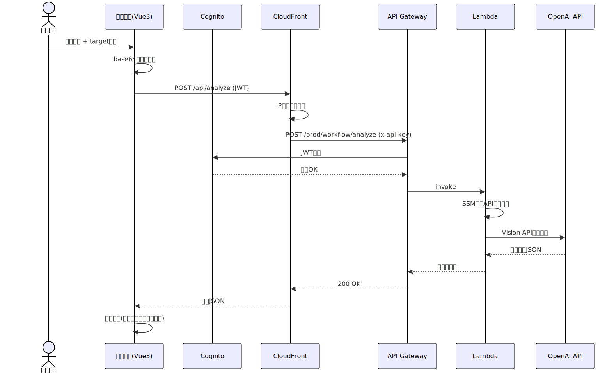
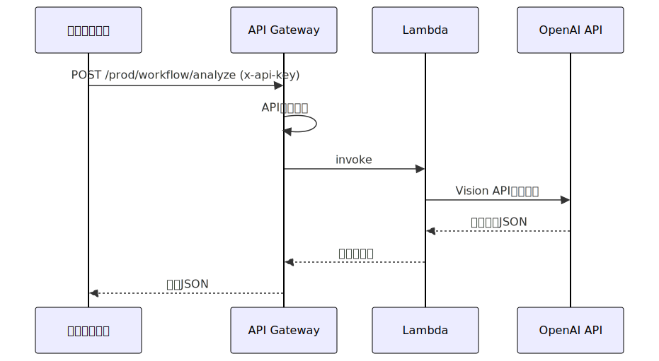

# アーキテクチャ設計書

## システム全体構成図

## データフロー図

### テスト画面経路

### ワークフロー経路

## シーケンス図

### テスト画面からの解析リクエスト

### ワークフローからの解析リクエスト

## コンポーネント一覧

| コンポーネント | 種別 | 説明 |
|--------------|------|------|
| CloudFront | CDN | 静的配信 + APIプロキシ + IP制限 |
| CloudFront Function | Edge | IPホワイトリスト + /api→/prod リライト |
| S3 Bucket | Storage | Vue3 SPAホスティング |
| API Gateway (REST) | API | RESTエンドポイント、認証統合 |
| Cognito User Pool | Auth | テスト画面ユーザー認証 |
| Lambda | Compute | 画像解析ハンドラ (Python 3.12) |
| SSM Parameter Store | Secret | OpenAI APIキー保管 |
| Route53 | DNS | カスタムドメイン管理 |
| ACM | Cert | SSL/TLS証明書 |
| CloudWatch Logs | Monitor | ログ収集・監視 |

## 技術スタック

| レイヤー | 技術 | バージョン |
|---------|------|-----------|
| フロントエンド | Vue 3 (Composition API) | 3.x |
| UI | Vuetify 3 | 3.x |
| 認証UI | @aws-amplify/ui-vue | latest |
| ビルド | Vite | 6.x |
| バックエンド | Python | 3.12 |
| AI SDK | OpenAI Python SDK | 2.24+ |
| IaC | AWS SAM / CloudFormation | - |
| テスト | pytest / Vitest / Playwright | - |
| CI/CD | SAM CLI | 1.154+ |
