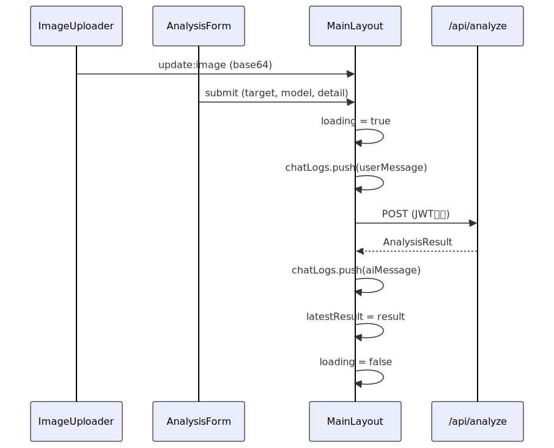

# フロントエンド設計書

## 画面遷移図



## コンポーネント構成図



## コンポーネント一覧

| コンポーネント | 責務 | 主要Props | Events |
|--------------|------|----------|--------|
| App.vue | ルート、Amplify認証ラッパー、レイアウト制御、API呼び出し | - | - |
| AppHeader.vue | ヘッダー、ユーザー名表示、サインアウト | user, signOut | - |
| ImageUploader.vue | D&D/クリック画像入力、プレビュー、バリデーション | - | update |
| AnalysisForm.vue | target/model/detail入力、解析ボタン | loading, hasImage | analyze |
| AnalysisResult.vue | 結果表示（発見バッジ＋確信度円グラフ） | found, confidence | - |
| ChatLog.vue | 解析ログ一覧（ユーザー/AIメッセージ統合） | entries | - |
| UsageGuide.vue | 使い方ステップガイド | - | - |
| SecurityPanel.vue | セキュリティ機能パネル（6項目表示＋詳細ダイアログ） | - | - |

## 状態管理

Composition API の `ref` / `reactive` でコンポーネント内管理。Pinia等のストアは不使用（単一画面のため）。

```typescript
// App.vue の主要状態
const imageBase64 = ref<string>('')      // アップロード画像 (Base64)
const imagePreview = ref<string>('')     // プレビュー用 DataURL
const loading = ref(false)               // 解析中フラグ
const chatLog = ref<ChatEntry[]>([])     // 解析ログ履歴
const latestResult = ref<{found: boolean, confidence: number} | null>(null)
```

### 型定義

```typescript
interface ChatEntry {
  id: number
  target: string
  imagePreview: string
  found: boolean
  confidence: number
  description: string
  tokens: number
  responseTime: number
  timestamp: Date
}
```

## API呼び出しフロー



## Amplify認証フロー



### Amplify設定

```typescript
Amplify.configure({
  Auth: {
    Cognito: {
      userPoolId: 'ap-northeast-1_XXXXX',
      userPoolClientId: 'XXXXX'
    }
  }
})
```

## ビルド・デプロイ

| 項目 | 値 |
|------|-----|
| ビルドコマンド | `npm run build` |
| 出力ディレクトリ | `frontend/dist/` |
| デプロイ先 | S3 Bucket → CloudFront配信 |
| 環境変数 | `.env` (UserPoolId, ClientId) |
