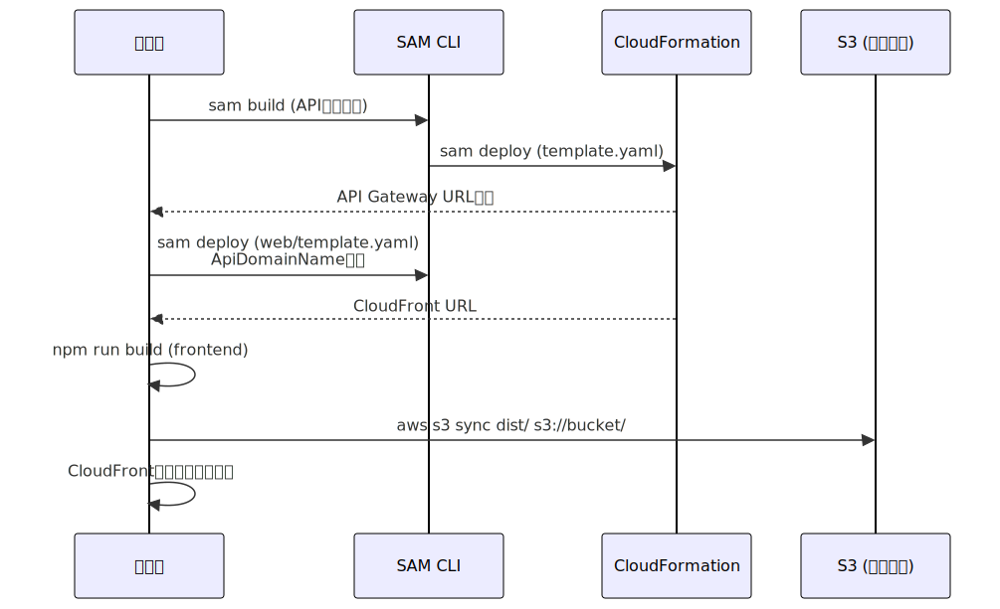

# インフラ設計書

## スタック構成

3テンプレートのネストスタック構成で管理する（external-system パターン踏襲）。

| スタック | ファイル | 内容 |
|---------|---------|------|
| 親スタック | template.yaml | ネスト定義、共通パラメータ |
| APIスタック（子） | api/template.yaml | Cognito, Lambda, API Gateway, IAM |
| Webスタック（子） | web/template.yaml | S3, CloudFront, Route53, CloudFront Function |

親スタックから子スタックへは `AWS::Serverless::Application` でパラメータを伝播し、
子スタック間の値受け渡しは `!GetAtt` による自動依存解決で行う。

## APIスタック (api/template.yaml)

### パラメータ設計

| パラメータ | 型 | デフォルト | 説明 |
|-----------|-----|----------|------|
| ResourcePrefix | String | - | リソース命名プレフィックス（親スタックから伝播） |
| OriginVerifyHeader | String | x-origin-verify | CloudFront認証ヘッダー名 |
| OriginVerifyValue | String | - | CloudFront認証ヘッダー値 |
| ProjectName | String | image-analysis | Projectタグ値 |
| LogLevel | String | INFO | Lambdaログレベル（DEBUG/INFO/WARNING/ERROR） |
| PowertoolsPython | String | - | AWS Lambda Powertools Layer ARN |

### リソース一覧

| リソース | Type | 説明 |
|---------|------|------|
| CognitoUserPool | AWS::Cognito::UserPool | ユーザー認証プール |
| CognitoUserPoolClient | AWS::Cognito::UserPoolClient | SPAクライアント |
| ImageAnalysisFunction | AWS::Serverless::Function | 画像解析Lambda |
| RestApi | AWS::Serverless::Api | REST APIエンドポイント（CognitoAuthorizer統合） |
| ApiKey | AWS::ApiGateway::ApiKey | ワークフロー用APIキー |
| UsagePlan / UsagePlanKey | AWS::ApiGateway::UsagePlan | スロットリング制御 |

### Lambda設定

| 項目 | 値 |
|------|-----|
| Runtime | python3.12 |
| Timeout | 60秒 |
| MemorySize | 512MB |
| Handler | handler.lambda_handler |
| Layers | AWS Lambda Powertools for Python |
| 環境変数 | ORIGIN_VERIFY_HEADER, ORIGIN_VERIFY_VALUE, SSM_OPENAI_API_KEY_PATH, LogLevel |

### IAMポリシー

```yaml
Policies:
  - SSMParameterReadPolicy:
      ParameterName: image-analysis/*
  - S3ReadPolicy:
      BucketName: '*'
```

## Webスタック (web/template.yaml)

### パラメータ設計

| パラメータ | 型 | 値 |
|-----------|-----|-----|
| SubDomain | String | image-analysis |
| HostedZoneId | String | ZXXXXXXXXXXXXX |
| AcmCertificateArn | String | arn:aws:acm:us-east-1:123456789012:certificate/xxxxxxxx-xxxx-xxxx-xxxx-xxxxxxxxxxxx |
| ApiDomainName | String | API Gatewayドメイン |
| AllowedIpAddress | String | 203.0.113.1 |
| OriginVerifyHeaderName | String | x-origin-verify |
| OriginVerifyHeaderValue | String | (APIスタックと同値) |

### リソース一覧

| リソース | Type | 説明 |
|---------|------|------|
| WebBucket | AWS::S3::Bucket | SPA静的ファイル |
| WebBucketPolicy | AWS::S3::BucketPolicy | OACアクセス許可 |
| CloudFrontOAC | AWS::CloudFront::OriginAccessControl | S3アクセス制御 |
| Distribution | AWS::CloudFront::Distribution | CDN配信 |
| IpRestrictionFunction | AWS::CloudFront::Function | IP制限+APIリライト |
| DnsRecord | AWS::Route53::RecordSet | Aレコード (Alias) |

### CloudFront設定

| 項目 | 設定 |
|------|------|
| DefaultRootObject | index.html |
| Default Origin | S3 (OAC) |
| /api/* Origin | API Gateway (カスタムオリジン) |
| ViewerProtocolPolicy | redirect-to-https |
| Certificate | ACM (us-east-1) |
| PriceClass | PriceClass_200 |

### CloudFront Function ロジック

```javascript
function handler(event) {
  var clientIp = event.viewer.ip;
  var allowedIp = 'ALLOWED_IP';

  // API以外のリクエストにIP制限適用
  if (clientIp !== allowedIp) {
    return { statusCode: 403, body: 'Forbidden' };
  }

  // /api/* → /prod/* リライト
  var uri = event.request.uri;
  if (uri.startsWith('/api/')) {
    event.request.uri = '/prod/' + uri.substring(5);
    event.request.headers['x-origin-verify'] = { value: 'VERIFY_VALUE' };
  }

  return event.request;
}
```

## ネットワーク構成図



## デプロイ手順

ネストスタック構成のため `sam deploy` 1コマンドで全リソースをデプロイ可能。

```bash
# 開発環境
bash deploy.sh dev

# 本番環境
bash deploy.sh prod
```


