# セキュリティ設計書

## 認証フロー図

### テスト画面経路

### ワークフロー経路

## IP制限設計

| 項目 | 値 |
|------|-----|
| 許可IP | 203.0.113.1 (許可IP) |
| 実装箇所 | CloudFront Function (viewer-request) |
| 対象 | テスト画面経路のみ（全リクエスト） |
| ワークフロー | IP制限なし (AWS内部通信のため) |

### CloudFront Function によるIP制限

WAFを使用せず CloudFront Function でIP制限を実施。

| 比較項目 | WAF | CloudFront Function |
|---------|-----|-------------------|
| コスト | $5/月〜 | 無料枠内 |
| レイテンシ | 数ms | <1ms |
| 柔軟性 | ルールベース | JavaScript |
| 本要件への適合 | ○ | ◎ (シンプル) |

## 脅威モデル (STRIDE)

| 脅威 | 分類 | リスク | 対策 |
|------|------|--------|------|
| 外部IPからのアクセス | Spoofing | 高 | CloudFront Function IP制限 |
| API Gateway直接アクセス | Tampering | 高 | Origin Verify Header検証 |
| 不正JWT使用 | Spoofing | 中 | Cognito Authorizer + トークン有効期限 |
| APIキー漏洩 | Information Disclosure | 中 | Usage Plan レート制限 + キーローテーション |
| OpenAI APIキー漏洩 | Information Disclosure | 高 | SSM SecureString + IAMポリシー制限 |
| 大量リクエスト | Denial of Service | 中 | API Gateway スロットリング + Usage Plan |
| 画像データの残留 | Information Disclosure | 低 | Lambda内処理のみ、永続化しない |
| ログへの機密情報出力 | Information Disclosure | 中 | base64画像データはログに含めない |
| CORS不正利用 | Elevation of Privilege | 低 | CloudFront経由のみ許可 |

## セキュリティ対策一覧

| カテゴリ | 対策 | 実装箇所 |
|---------|------|---------|
| 通信暗号化 | HTTPS (TLS 1.2+) | CloudFront + ACM |
| アクセス制御 | 許可IP限定 | CloudFront Function |
| 認証 (テスト画面) | Cognito JWT | API Gateway Authorizer |
| 認証 (ワークフロー) | APIキー | API Gateway APIキー |
| API直接アクセス防止 | Origin Verify Header | CloudFront → API Gateway |
| シークレット管理 | SSM SecureString | Lambda → SSM |
| レート制限 | Usage Plan | API Gateway |
| ログ保護 | 画像データ非出力 | Lambda実装 |
| データ非保持 | メモリ内処理のみ | Lambda |
| CORS | 同一オリジンのみ | API Gateway |

## データフロー図（機密データ）

**画像データのライフサイクル:**

1. クライアントからHTTPSで送信
2. CloudFront/API Gatewayは通過のみ（保存なし）
3. Lambda関数内メモリで処理
4. OpenAI APIへHTTPSで転送
5. 結果のみ返却。画像データは永続化されない
6. Lambda終了後、メモリ解放
